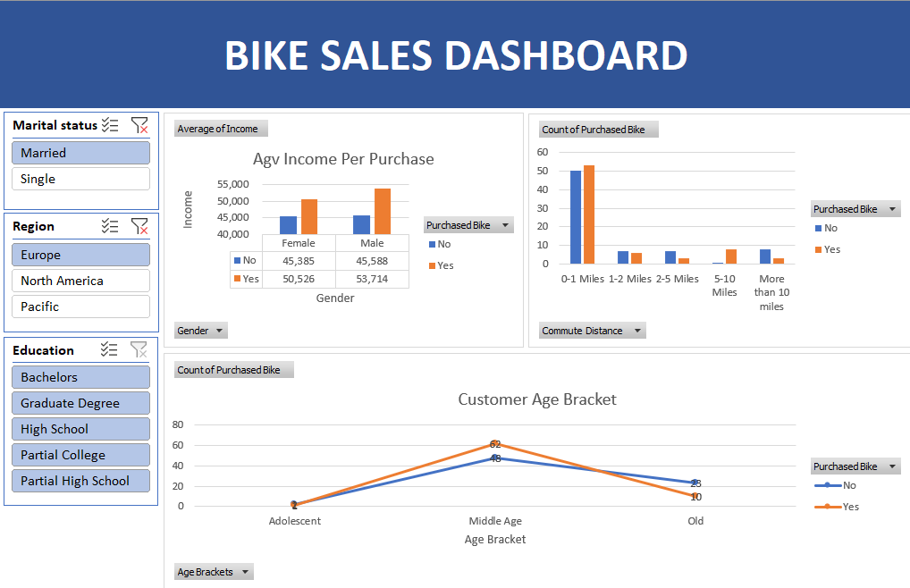

# Excel bike buyers analysis

## Overview

This is a project to analyze data on bike buyers from different regions and classes. This uses Excel to analyze and visualize data, under pivot tables and interactive dashboards.

## Results

### Pivot table

|  |
| :--: |
| *Average Income per Purchase* |

The first pivot table shows the average income of the people who either bought bike(s) or did not, categorized by their gender. Form this pivot table, we visualized this data using a clustered column chart.

### Dashboard

|  |
| :--: |
| *Bike Sales Dashboard* |

In this dashboard, we use the charts created from the pivot tables, besides creating filters such as gender, region, and education level from which the information that users want to find will show up on those charts clearly and easily to understand. For example, in the above picture the data is filtered by married people who live in Europe from all level of education.
