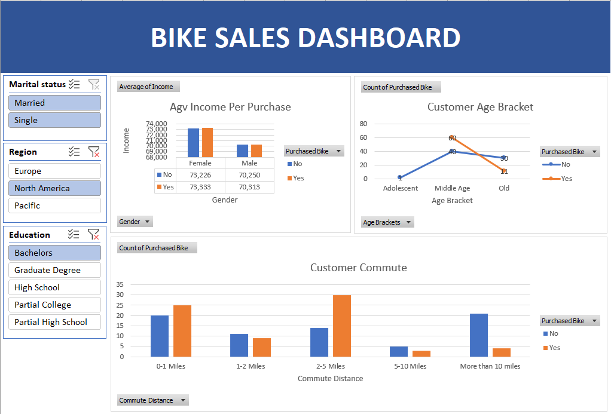

# Excel bike buyers analysis

## Overview

This is a project to analyze data on bike buyers from different regions and classes. This uses Excel to analyze and visualize data, under pivot tables and interactive dashboards.

## Results

### Pivot table

|  |
| :--: |
| *Average Income per Purchase* |

The first pivot table shows the average income of the people who either bought bike(s) or did not, categorized by their gender. Form this pivot table, we visualized this data using a clustered column chart.

|  |
| :--: |
| *Customer Age Bracket* |

The second pivot table is about the customer age bracket. Compared with three different age groups, middle age accounts for about 80% of bicycle purchases. The percentage of bike buyers in middle age is roughly 50% which is higher than the groups of adolescents and old people (30%).

|  |
| :--: |
| *Customer Commute* |

The last pivot table shows the average distance customer commute. This Excel file has the most data for customers with commute distances from 0 to 5 miles, where most of the transactions occur. At 5 miles or more, the percentage of people buying bikes tends to decrease.

In short, we should target customers who are middle-aged and have a travel distance of less than five miles.

### Dashboard

|  |
| :--: |
| *Bike Sales Dashboard* |

In this dashboard, we use the charts created from the pivot tables, besides creating filters such as gender, region, and education level from which the information that users want to find will show up on those charts clearly and easily to understand. For example, married and single people from both genders who have graduated from college with a bachelor's degree and living in North America.

## Method

### Cleansing data

We will get the raw data and our job is to clean up the data and make it as easy to understand and clear as possible. Next, we will create a working sheet from the raw data sheet. The goal is to keep the original data intact, in case we will mess something up and make it easier to work with.

First, create a filter for each column, to easily find data.

In the working sheet, We will clean up the duplicated data.There are about 26 duplicate values found and removed. 

There are a few abbreviations such as M and S in the Marital Status column and F and M in the Gender column. For readability and implementation in the following steps, we will replace these acronyms with complete words. We going to do M equals and replace it with Married. Similar to the words S -> Single, M -> Male, and F -> Female.

There are 13 different fields here.

* ID: This is a unique number. It shows the customer's number to easily find without having duplicate information.

* Marital status: Married or single.

* Gender: Male and Female.

* Income: The minimum income is 10,000$ and the highest is 170,000$ per year.

* Children: From 0 to 4 children.

* Education: Have 5 level which are Bachelors, Graduate Degree, High school, Partial College and Partial high school.

* Ocuppation: Clerical, Management, Manual, Processional, Skilled Manual.

* Home owner: Yes, No.

* Cars: From 0 to 4.

* Commute distance: 0 to 1, 1 to 2 miles, 2 to 5 miles, 5 to 10 miles, +10 miles.

* Region: Europe, North America, Pacific.

* Age: Adolescent, Middle age, Old.

* Purchased bike: Yes, No.

### Create Pivot table

Click on Insert and select the pivot table, then move to the working sheet and select all, a table will appear as shown below. Then will enter what is needed.

|  |
| :--: |
| *Pivot Table example* |

### Creating Charts

|  |
| :--: |
| *One of charts* | 

In this pivot table sheet, we create more corresponding charts for each table. By selecting Insert, click Recommended Charts, then the charts will appear. The thing here is that we will choose which chart matches the tabular data to represent it in an easy-to-understand and beautiful way.

### Create dashboard

In the dashboard sheet, use the charts created from the pivot table, besides creating filters such as gender, region, and education from which the information that users want to find will be displayed on those charts in an appropriate way. clear and easy to understand.
And when finished the dashboard will look like this.

|  |
| :--: |
| *Dashboard* |